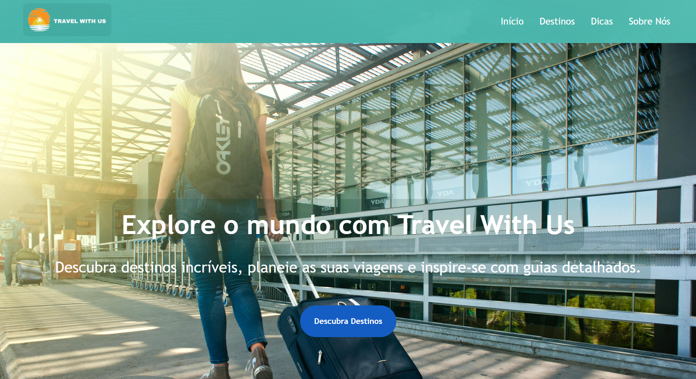
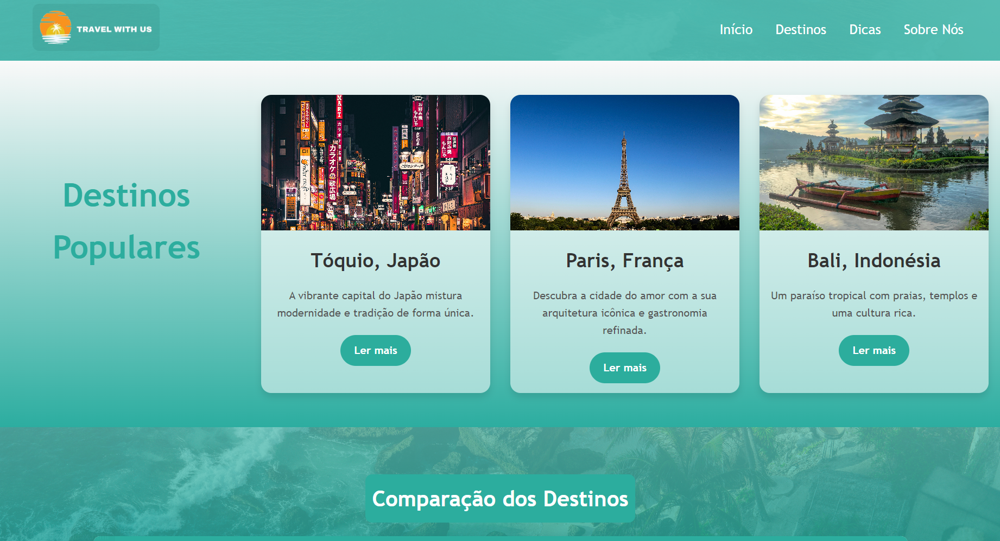
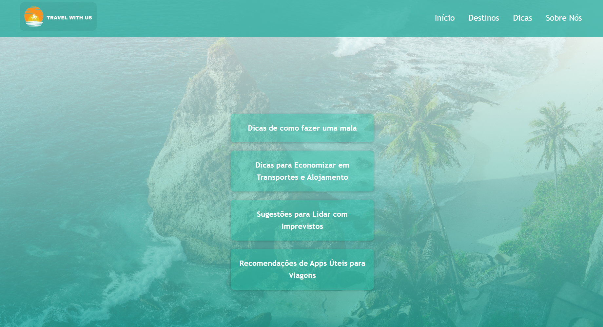
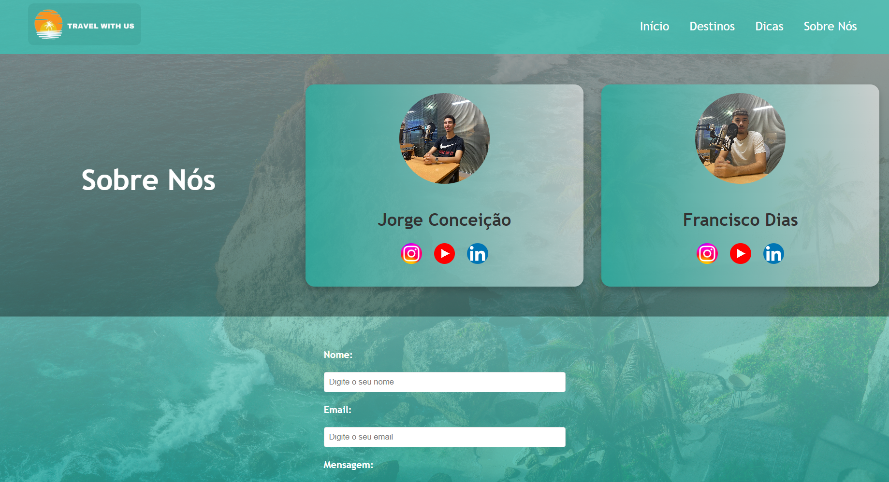
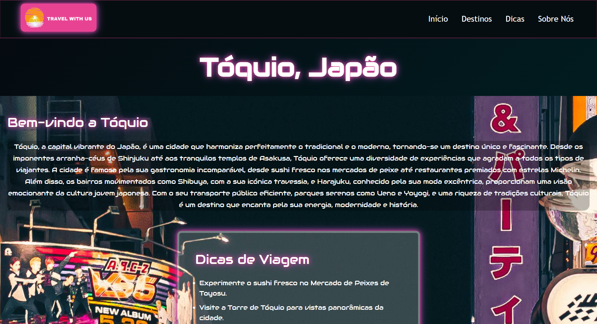
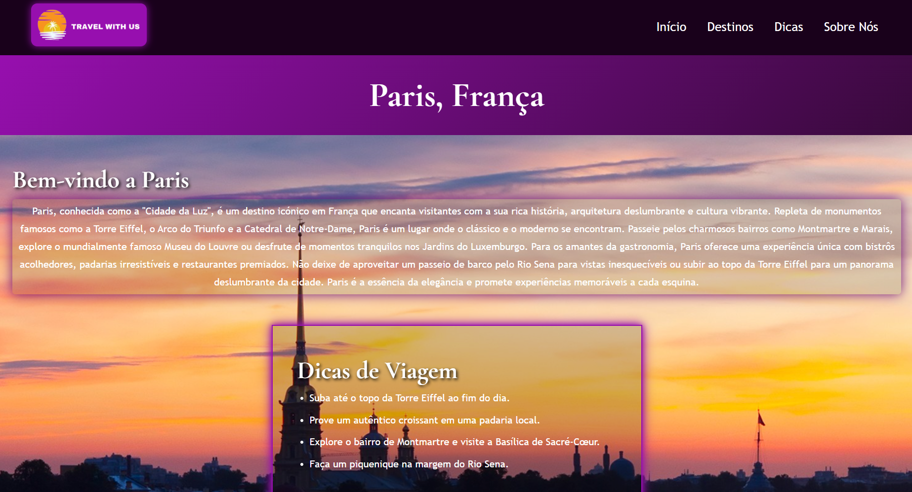
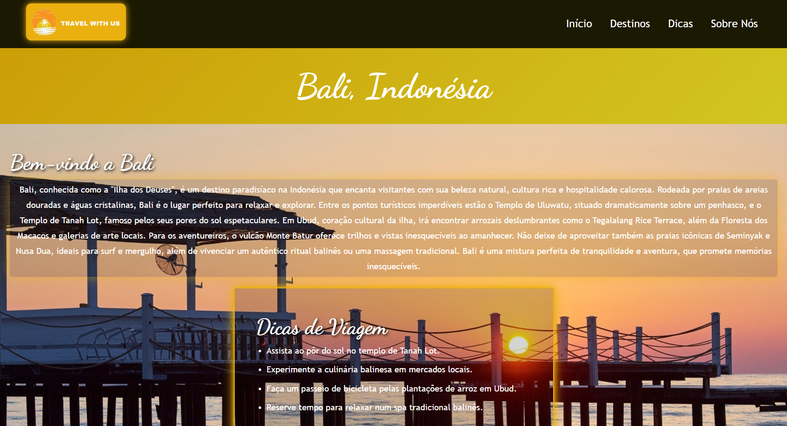

# Travel With Us  

Repositório para alojar o projeto desenvolvido para "Tecnologias Web", uma unidade curricular do segundo ano do curso Tecnologia de Comunicação Multimédia na UMAIA.  
Desenvolvido por **tcm24twg05**

---

# Relatório do Projeto: Travel With Us

## Introdução
O projeto **Travel With Us** tem como objetivo o desenvolvimento de um website dedicado ao planeamento e à inspiração para viagens. A plataforma procura ser intuitiva e visualmente apelativa, ajudando os utilizadores a descobrir novos destinos, aceder a informações úteis e organizar as suas próximas aventuras. A proposta é oferecer uma experiência prática e informativa, ideal para quem procura inspiração ou apoio no planeamento de viagens.

## Estrutura do Website
O website será composto por quatro páginas principais, cada uma projetada para cumprir uma função específica:

### 1. Página Inicial
Esta página irá introduzir os utilizadores ao site, destacando:

- **Destinos mais populares:** Com imagens apelativas e informações resumidas.
- **Mensagem de boas-vindas:** Um texto motivador que cative o visitante logo à chegada.
- **Sugestões de navegação:** Links rápidos para as restantes secções.

### 2. Destinos
Uma galeria interativa organizada por categorias, como:

- Destinos de praia, montanha, cidades históricas e aventuras.

Cada destino incluirá:

- **Descrição breve:** Texto explicativo sobre o local.
- **Imagens:** Fotografias de alta qualidade.
- **Tabela informativa:** Dados como a melhor época para visitar, custos médios e atividades recomendadas.

A organização interativa desta página ajudará os utilizadores a explorar diversas opções e tomar decisões informadas.

### 3. Dicas de Viagem
Esta página oferecerá conselhos práticos para ajudar os utilizadores a aproveitarem ao máximo as suas viagens. Os tópicos incluem:

- **Como fazer uma mala eficiente.**
- **Recomendações de apps úteis para viagens.**
- **Dicas para economizar em transportes e alojamento.**
- **Sugestões para lidar com imprevistos, como cancelamentos ou atrasos.**

### 4. Sobre Nós
Uma secção dedicada à equipa e à missão do projeto. Inclui:

- **Apresentação da equipa:** Informar os utilizadores sobre os responsáveis pelo site.
- **Missão do website:** Objetivo e valores do projeto.
- **Contactos:** Formas de entrar em contacto, como e-mail e redes sociais.
- **Links úteis.**

Esta página reforçará a credibilidade do projeto, criando maior confiança junto dos utilizadores.

## Características do Design
- **Design responsivo:** Garantirá que o website funcione perfeitamente em todos os dispositivos, desde computadores a smartphones.
- **Elementos dinâmicos:** Como efeito hover e diferentes estilos, para enriquecer a experiência do utilizador.
- **Interatividade:** Funcionalidades interativas que mantêm o utilizador envolvido.

## Conclusão
O **Travel With Us** será uma ferramenta poderosa para quem procura inspiração e apoio no planeamento de viagens. Ao combinar um design apelativo, informações úteis e funcionalidade interativa, o projeto visa oferecer uma experiência única que atende às necessidades dos viajantes modernos.

---

## Organização do Repositório   

As imagens utilizadas encontram-se na pasta [`Imagens`](Web/Imagens).  
O código-fonte encontra-se na pasta. [`Web`](/Web) 
- Página Inicial: [`index.html`](Web/index.html)
- Destinos: [`destinos.html`](Web/destinos.html)
- Dicas : [`dicas.html`](Web/dicas.html)
- Sobre Nós : [`sobre.html`](Web/sobre.html)
---

## Galeria  

Aqui estão os resultados finais do projeto:

|         |         |         |
|---------------------------------------|---------------------------------------|---------------------------------------|
| Página Inicial                        | Página dos Destinos                   | Página das Dicas                      |
|         |         |         |
| Página de Sobre Nós                   | Estilo Dedicado á Página de Tóquio    | Estilo Dedicado á Página de Paris     |

|         |
|---------------------------------------|
| Estilo Dedicado á Página de Bali    |

---

## Tecnologias  

As tecnologias utilizadas foram:  

- [XML](https://www.w3schools.com/xml/)  
- [HTML](https://www.w3schools.com/Html/) + [CSS3](https://www.w3schools.com/css/)  
- [JavaScript](https://www.w3schools.com/js/) 

---

## Report

### Project Presentation – Apresentação do projeto
- [Proposta](Relatório/Proposta)
### Interface do utilizador
- [Organização](Relatório/InterfaceUtilizador)
### Produto
- [Produto](Relatório/Produto)

### Apresentação
- [Apresentação](#)
  

---

## Grupo

- @JorgeConceicao-umaia
- @fmsj0
