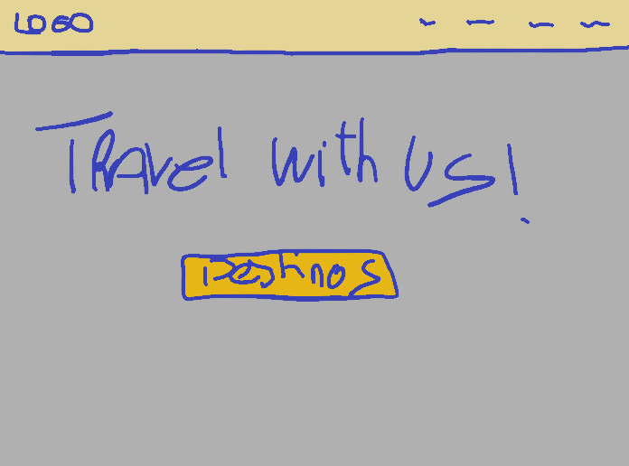
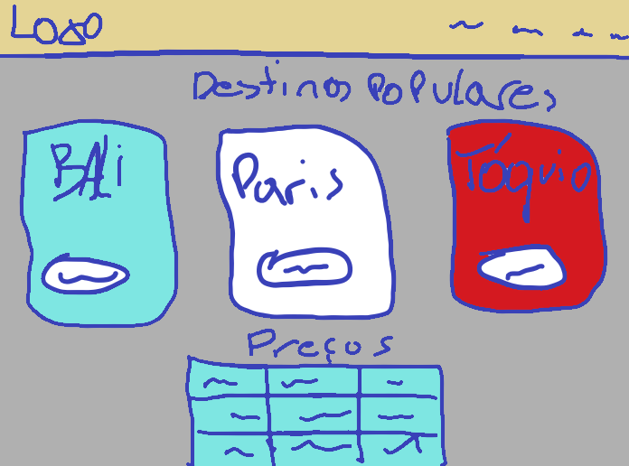
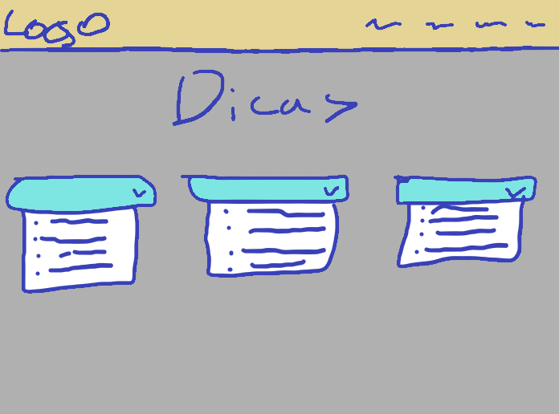
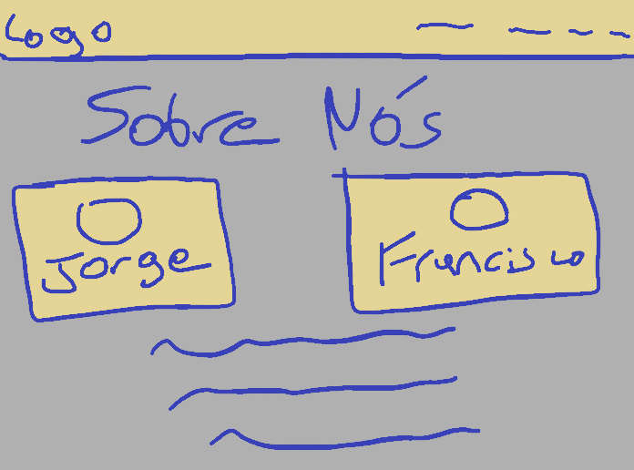
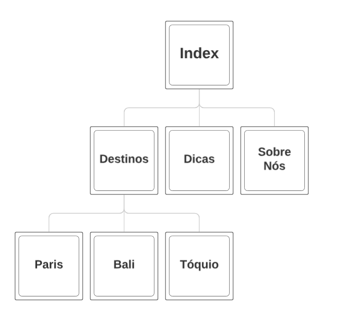

## 1. Página Inicial  

### **Design Escolhido**  
- **Logótipo no topo**: Posicionado de forma central ou à esquerda, reforça a identidade visual da plataforma e é facilmente acessível.  
- **Mensagem central "Travel With Us!"**: Frase impactante que transmite o propósito do site logo de início, criando uma ligação emocional com o visitante.  
- **Botão destacado para "Destinos"**: Permite acesso rápido à secção principal, direcionando a navegação para a funcionalidade mais procurada.  
-   

### **Justificação**  
Este layout é simples, direto e eficaz para captar a atenção do utilizador desde o início. A mensagem central combinada com o botão de acesso rápido facilita a experiência de navegação, garantindo que os visitantes consigam explorar o conteúdo principal rapidamente.  

---

## 2. Página de Destinos  

### **Design Escolhido**  
- **Blocos interativos para destinos populares (Bali, Paris, Tóquio)**: Apresentam imagens grandes e coloridas com o nome dos destinos.  
- **Tabela com preços**: Informações práticas e organizadas para fácil comparação entre destinos.  
-   

### **Justificação**  
Os cartões visuais destacam os destinos de forma atrativa, incentivando o utilizador a explorar. A inclusão de uma tabela com preços ou informações práticas complementa a inspiração visual com dados objetivos, ajudando na tomada de decisão de forma rápida e eficiente.  

---

## 3. Página de Dicas de Viagem  

### **Design Escolhido**  
- **Caixas individuais para dicas**: Organizadas como painéis simples que incluem listas claras e concisas.  
- **Estilo consistente com o site**: As caixas possuem um design limpo e facilmente navegável, alinhado com o restante do website.  
-   

---

## 4. Página de Sobre Nós  

### **Design Escolhido**  
- **Caixas individuais para cada criador**: Organizadas como painéis simples que mostram as nossas caras e links associados.  
- **Estilo consistente com o site**: As caixas possuem um design limpo e facilmente navegável, alinhado com o restante do website.  
-   

### **Justificação**  
A organização das nossas caras em painéis permite que o conteúdo seja apresentado de forma clara e prática.  

---

  

Essas escolhas de design refletem o compromisso com uma experiência de utilizador simples, informativa e visualmente apelativa, alinhada com a missão do site "Travel With Us".  
